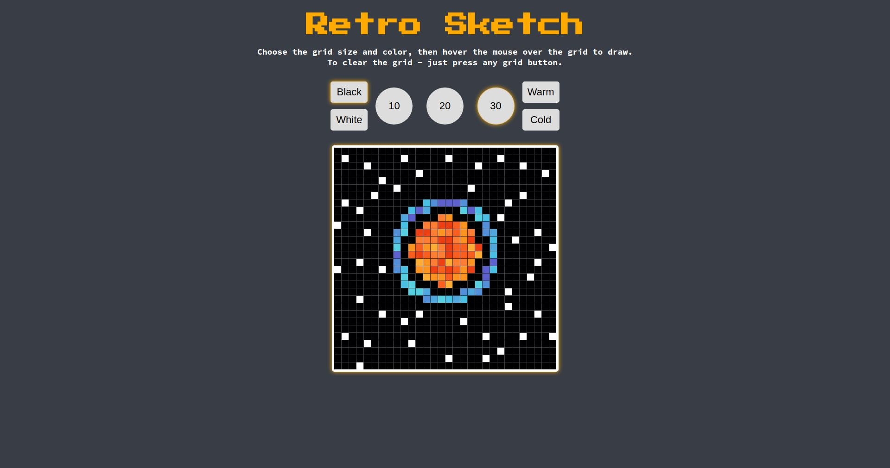

# The Odin Project

## Etch-a-Sketch - Foundations Course Final Project

- A browser version of an Etch-a-Sketch toy.
- Credit to **mooniiDev** for **UI** inspiration.

### What I Learned / Improved

- Learned how to work with **CSS Grids**.
- Increased my knowledge about the **DOM** and how to work with it.
- Increased my knowledge about **events** in JavaScript.

### Project Preview

